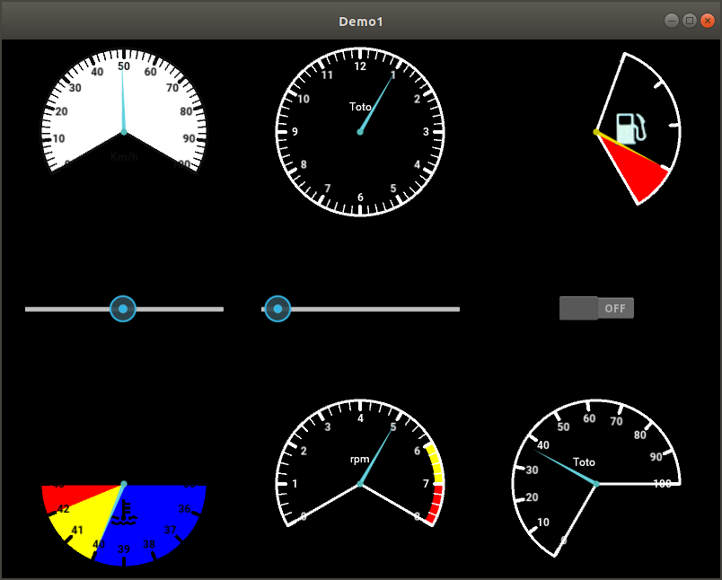

SpeedMeter is a versatile Kivy widget aimed at representing numerical
‘physical’ values in a “clock-face” or dial manner.

Minimum and maximum value, and the start and end angle, notably, are
fully configurable. For the sake of readability, the “labels”
(intermediate values represented on the dial) are integers, but you
can override the display function to represent whatever string fits
your needs, as illustrated with PI fractions in demo1.

SpeedMeter is clickable, so you can click on it, and the widget is
able to compute the corresponding physical value.

All default values are “reasonable”, so if you do nothing, you get a
working widget for the range 0..100 (asymmetric, because I think it’s
cool).

For now, SpeedMeter has been tested under Linux and Android (with
buildozer).

Speedmeter functionalities were heavily inspired by Andrea Gavana’s
SpeedMeter for wxPython.

The documentation is at https://chtronche.github.io/speedmeter/
