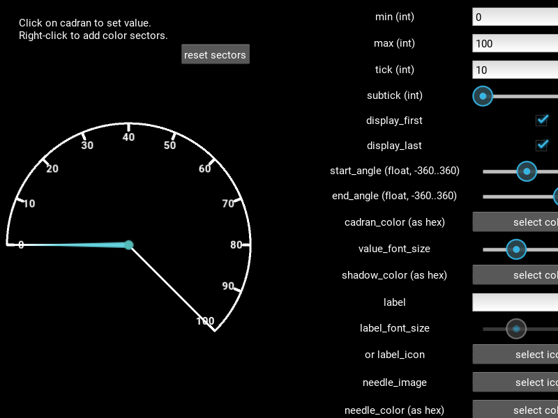

Demos
#####

.. _demo1:

demo1
*****

.. image:: demo1.png
    :width: 50%
    :align: right

demo1 is basically the wxPython speedmeter demo rewritten with my
widget. This was my guide when writing it, I basically declared
mission accomplished when the widget was good enough to replicate
wxPython's demo.

.. _demo2:

demo2
*****

demo2 has the controls to change almost all parameters of the
widget. You can play with it to see the effect of changing this or
that parameter. When starting, all the parameters are set to the
widget defaults.
